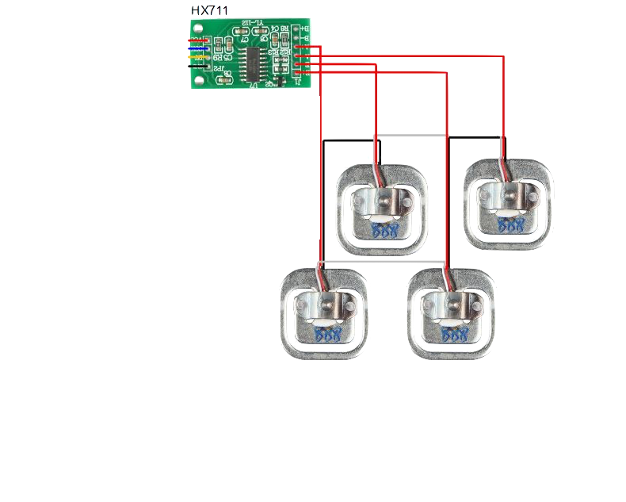

[//]: # (pandoc PECL1.md -o PECL1.pdf --pdf-engine=xelatex)

\newpage
# Introducción

-

\newpage
# Contexto

-

\newpage
# Misión y alcance del proyecto seleccionado

-

\newpage
# Descripción de ideas descartadas

-

\newpage
# Tecnología a utilizar

Para llevar a cabo el proyecto hemos decidido utilizar un amplio abanico de tecnologías.
Esto es debido a que IOT es una ciencia multidisciplinar por lo que aunque solo se deseé realizar un pequeño prototipo hacerlo supone trabajar en ramas muy diversas dentro de las ciencias de la computación.
Como mínimo para un proyecto genérico será necesario realizar las siguientes tareas:

- Obtener información de distintos sensores o dispositivos.
- Filtrar y procesar dicha información de modo que la comprimamos sin sacrificar precisión
- Almacenar la información de forma segura y accesible en escritura por dispositivos que la generan y en lectura por los que la deban mostrar al usuario.
- Interpretar dicha información para inferir otra nueva generando conocimiento adicional.
- Mostrar al usuario la información de forma inteligible y accesible.
- Transportar la información de un lugar a otro de forma rápida y segura.

Con la intención de cumplir cada una de estas tareas detallamos a continuación las tecnologías empleadas para realizar cada una de las tareas mencionadas.
La relación a alto nivel entre cada una de ellas puede visualizarse en el siguiente diagrama de despliegue.


## Obtención de la información

Esta es la parte de más bajo nivel del proyecto.
Para llevarla a cabo ha sido necesario montar pequeños circuítos que nos permitieran alimentar tanto las placas controladoras como los sensores, además de conectar estos entre si de modo adecuado.

### Placas controladoras

Hemos utilizado dos placas controladoras cuya misión es la de leer los datos de los sensores.
Debido a la limitación de entradas analógicas de las placas y la gran cantidad de sensores analógicos que hemos utilizado ha sido necesario utilizar dos.

#### Arduino uno


#### Arduino due


### Sensores

Hemos utilizado una variada gama se sensores con el fin de recoger la mayor cantidad de información del entorno posible.
Debido a que estamos construyendo un prototipo hemos decidido hacer esto para poder descubrir que sensores nos proporcionan mayor información sobre los hábitos de sueño de los usuarios.

#### Sensores de flexibilidad

Estos sensores nos proporcionan la información de cuan doblados están.
Dicha información de forma aislada puede resultar vana y poco informativa, no obstante debido a que utilizamos una gran cantidad de sensores en una disposición muy concreta podemos inferir datos de gran utilidad.

Utilizando estos sensores hemos construido un detector de posición que nos permite conocer la posición exacta del usuario cuando está tumbado en la cama.
Realizando un seguimiento de esta información somos capaces de detectar movimientos del usuario a partir de los cuales (junto a otros datos) determinamos la calidad del sueño de este.
Para hacerlo situamos los sensores en dos líneas paralelas de modo que todo el ancho de la cama esté cubierto por al menos un sensor.
Cuando un sensor esté doblado podremos ubicar un lateral del cuerpo del usuario.

Explicando la implementación con mayor nivel de detalle es necesario mencionar que esto no se realiza exáctamente así.
La longitud de la cama es realmente discretizada en el doble de segmentos de la cantidad de sensores de que disponemos.
Cuando dos sensores próximos indican que están doblados podemos identificar que el lateral del cuerpo del usuario realmente entre ellos en vez de sobre ambos a la vez.

Tratando la función discreta que generamos somos capaces de dibujar una silueta precisa del cuerpo usuario sobre el sensor.


#### Sensor de peso

El uso principal de este sensor es detectar cuando un usuario está encima de la cama.
Gracias a esa información podemos grabar el tiempo fuera del horario nocturnos que el usuario pasa tumbado o sentado en la cama.

Adicionalmente podremos grabar ese mismo tiempo a lo largo de la noche para almacenar el tiempo de sueño.
Como una característica adicional podemos grabar la cantidad de peso se ha perdido durante la noche principalmente por pérdida de agua.

Estos sensores no son utilizados de forma directa si no a través de un amplificador y multiplexor de la señal que ya se encarga de leer cada sensor y realizar un primer procesamiento de la información que proporcionan.



Desde las placas controladoras leeremos este amplificador utilizando una entrada digital para acceder a la información del peso y una salida digital para generar una señal cuadrada que al ritmo de la cual el amplificador nos envía bit a bit la información que contiene.

```c++
//Leer cada byte (3 en total) que contiene la información del peso
for(i = 0; i < 8; ++i) {
  digitalWrite(clockPin, HIGH);
  delayMicroseconds(1);
  if(bitOrder == LSBFIRST)
      value |= digitalRead(dataPin) << i;
  else
      value |= digitalRead(dataPin) << (7 - i);
  digitalWrite(clockPin, LOW);
  delayMicroseconds(1);
}
```

#### Sensores de sonido


#### Sensores de luz

#### Sensor de humedad

#### Sensor de temperatura

## Filtrado y procesado de la información

De cada sensor leemos la información a la máxima velocidad a la que la placa puede hacerlo con la intención se sobre muestrear lo máximo posible.
Cada medida obtenida es introducida en un filtro pasa bajos, pasa altos y de suavizado.
Dicho proceso es realizado en las placas controladoras reduciendo la frecuencia de envío de mensajes pero aumentando la calidad y fiabilidad de la información transmitida.
Con esto logramos minimizar el ruido de las señales medidas de forma temprana.

La información que se genera en las placas controladoras es enviada por bluetooth a la RaspberryPI donde le añadimos una marca de tiempo antes de enviarla finalmente a la base de datos para ser almacenada.

Hacer esto nos permite reunir la información en paquetes de gran tamaño de modo que nos comuniquemos con la base de datos en una frecuencia menor aprovechando más el ancho de banda disponible.
Esto reduce los problemas de saturación de las comunicaciones.

### RaspberryPI

La RaspberryPI como hemos mencionado juega un papel de buffer intermediario entre la base de datos y las placas controladoras.
Dicha tarea podría haber sido realizada por otro tipo de placa más simple y barata como una ESP32, no obstante debido a que estamos construyendo un prototipo hemos decidido aprovechar el material del que disponíamos además de la fiabilidad y versatilidad que esta plataforma proporciona.
La programación de la raspberry ha sido realizada en Python pues es uno de los lenguajes con más soporte en esta plataforma.

## Tansmisisión de la información

### Controladores -> RaspberryPI

### RaspberryPI -> Base de datos

### Base de datos -> Front End

### Front End -> Usuario

## Almacenamiento de la información

## Interpretación de la información

## Mostrar la información al usuario

\newpage
# Metodología de desarrollo

## Adaptación de la metodología a nuestro caso concreto

### Prueba y aprendizaje

### Diseño

### Ejecución

### Pruebas

### Reuniones

### Entregas

\newpage
# Modelo de negocio

-

\newpage
# Planes de producción, marketing y financiero-inversión-retorno

-

\newpage
# Planificación temporal, plan de desarrollo, riesgos, plan de contingencias 

-

\newpage
# Resumen y conclusiones

-
